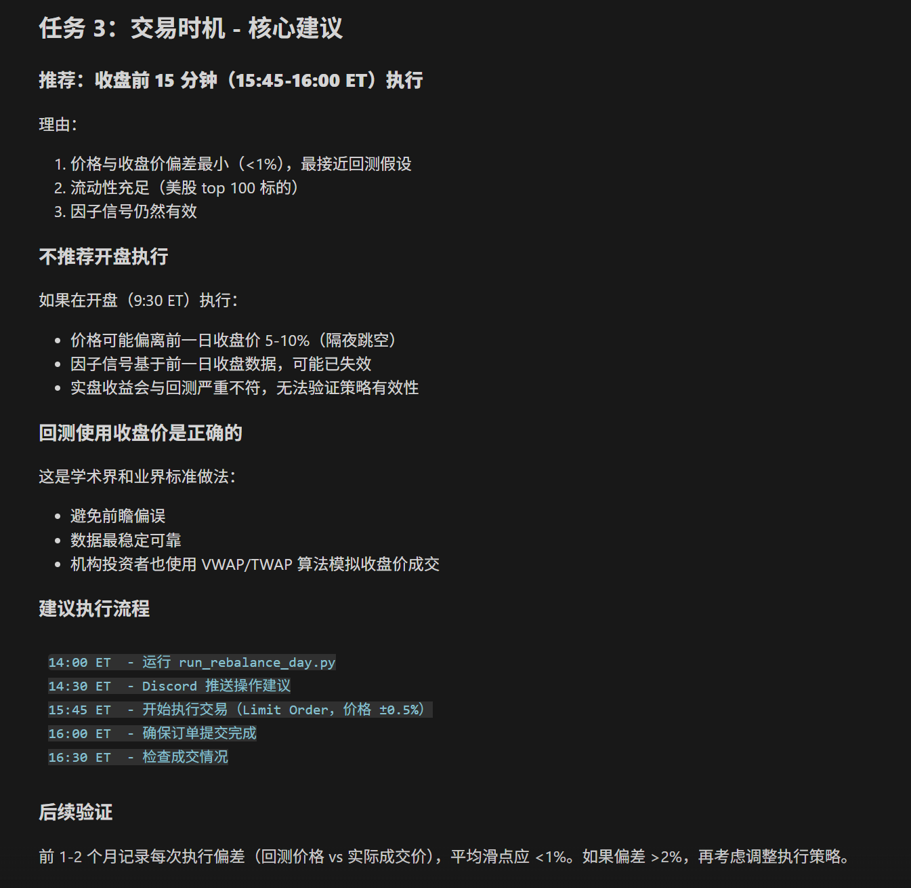

# 多因子

创建时间: January 18, 2026 4:44 AM

## 数据获取

标的池：美股

字段：开盘价，收盘价，最高价，最低价，成交量(volume)，成交额(amt)，涨跌幅，换手率

时间：20年至今的日频数据

来源：在python中调用 接口，写入本地；yahoofinance免费开源，alpaca免费API可以直接交易

## 构造因子

输入输出：

输入：原始量价数据excel，观察期N（参数） e.g. 从2天-60天；处理：利用数据构造因子值；

输出：每一个因子一个excel，其中不同sheet对应不同观察期N下的因子

量价因子：基于价格，涨跌幅，成交量，换手率

~~基本面因子：财报/快报/预告：e.g.成长能力；盈利能力：利润；营运能力：费用，成本~~

~~分析师：预期/超预期~~

~~资金面因子~~

~~市场情绪因子~~

## 数据处理

输入输出：

输入：构造好的因子数据 Excel

处理：对每一期（同一时间点（天），截面数据）因子，去极值，标准化，中性化

i.e. 对一天（行）的所有股票代码的单一因子的值进行处理，只对股票与股票比较

输出：处理后的因子数据 Excel

去极值：

· 均值方差去极值：均值+-3个标准差以外的值用边界值替代 （容易受极值影响）

· 中位数去极值（使用最多）：计算因子中位数median，定义因子绝对中位数=因子值减去中位数后的中位数，将位于median+-3*1.4826MAD以外的值用边界值代替

· 分位数去极值：取因子上下分位数，比如5%和95%上下分位数，将位于分位数以外的数据用分位数代替

标准化：

1. 减去取值再除以样本标准差，用zscore代替原有因子值
    
    $zi​=​ (fi​−μ)​​ / σ$
    
2. 对所有刚得到的因子进行标准化

~~中性化~~

~~· 行业中性（去除不同行业的差异）：行业均值做差，用现在因子值减去行业均值的差；回归取残差（离散）~~

~~· 市值中性：与市值的对数回归后的残差~~

## 单因子测试

输入输出：

输入：处理好的因子excel，return当日收益率excel，调仓周期，分层数量，层内资产配置方式

处理：使用Jupter计算每一期的IC，分组等信息，观察统计所有期的信息绘制图片

输出：单因子测试pdf（IC分析， Rank_IC分析， 多空回测，多头回测， 空头回测），写入本地

前置准备：

· 拿上一期的因子值和这一期的日收益率return做相关性分析，因子下移一行

· 对每个调仓日，计算周期内因子值，累计收益率，IC，rank_ic，分组，group_ic

e.g. 调仓周期T，每过T天换一次多头头寸标的物；使用调参日前一天的因子值作为这一期的因子值，这个月的累计收益率作为这一期的收益率

分组：每个周期内的因子值进行打分，e/g/分十层，每层30个股票，因子值最高的30个股票为组号10，因子值最小的为1

group_ic: 组内收益率做加权，e.g.30个股票一组，对30个股票做平均化或者因子打分加权得到一个组内收益率

对1-10组和组内收益率进行相关性分析，看组内收益率是不是随着组号增大而增大

IC，Rank_IC分析：

遍历不同调仓周期，分别取IC，rank_IC

统计IC，rank_IC均值，IR（IC / 标准差），偏度，峰度，t值，p值

绘图：年度IC柱状图，月度IC色阶图，调仓日IC折线图，调仓日累计IC折线图（最重要的，希望一直变大）

多空测试：

遍历不同调仓周期，分别取第一组多头，倒一组空头，第二组多头，倒二组空头组合

i.e. 买入第十组，第九组，卖出第一组，第二组

统计年化收益率，波动率，夏普，最大回撤，胜率，PnL

绘图：净值折线图，月度收益率色阶图，调仓日收益率折线图

分层多头：

遍历不同调仓周期，分别取return，excess_return

统计每组多头下的年化收益率，波动率，夏普，最大回撤，胜率，PnL

绘图：分组净值折线图，分组累计收益率柱状图，调仓日收益率折线图

分层空头：

遍历不同调仓周期，分别取return，excess_return

统计每组空头下的年化收益率，波动率，夏普，最大回撤，胜率，PnL

绘图：分组净值折线图，分组累计收益率柱状图，调仓日收益率折线图

## 多因子集中测试

输入输出：

输入：多个factor数据的excel，return数据excel

处理：多因子集中测试

输出：多因子集中测试报表excel，

sheet1：每一行不同因子名称，每一列调仓周期的测试指标（mean， IR， t_value， rank_ic_mean， rank_ic_ir， rank_ic_t_value，group_rank_ic_mean， group_rank_ic_ir， group_rank_ic_t_value， 多空回测收益率，多空回测夏普，多头超额， 多头夏普， 空头超额， 空头夏普， ic_p_value，rank_ic_p_value，group_rank_ic_p_value），对每一列绘制色阶

sheet2：每一行为时间日期，每一列不同因子名称，数据为因子的累计ic，生成一个额外的折线图

sheet3：多头累计超额（收益-市场涨幅），行为日期，列为因子名称，绘制折线图

sheet4：多头累计收益率，行尾日期，列为因子名称，绘制折线图

note：p值越小（绿）越好，其他值越红越好；t_value=mean(IC)/ (std(IC) / sqrt(T))；p_value < 0.05显著，<0.01强显著

计算sheet1：

调用单因子测试里构建好的函数，得到IC, rank_IC，因子收益率，group_rank_ic的均值，IR，t值，p值

计算多空组合年化收益率夏普，多头超额年化收益率，超额夏普

计算sheet234：累计ic，多头累计超额收益率，多头累计收益率

Note: rank_IC去极值，group_IC避免偏科因子（i.e.只能避免10%最差的，无法具体分辨剩余90%）

t_value=信号/噪音=（样本均值-假设均值）/标准误差，t值越大信号强于噪音，t值接近0信号淹没于噪音

p_value显著性<0.01

## 共线性分析

分析因子之间的相关性，e.g.价格斜率和价格涨跌幅

输入输出：

输入：多个因子数据excel，return数据excel

处理：共线性分析

输出：多因子共线性分析报表Excel：

sheet1：两个matrix，Matrix1是因子收益率之间的相关性beta_corr，Matrix2是因子截面期相关性的均值factor_corr；

sheet2：corr序列，列名为配对因子名称（因子1vs因子2），行为每一天（调仓日），值为相关性系数，（可以画出每一个的折线图）

sheet3：cum_corr累计序列，把sheet2做历史滚动累计相加，绘制出不同配对因子的斜率曲线，（如果斜率高说明相关性大，如果斜率低在0附近说明不相关）

Matrix1因子收益率分析:

在截面数据上（每一天/调参日），用上一期因子拟合当前收益率（一元回归），得到回归参数beta估计，即因子收益率

  

对多个因子的因子收益率序列，计算相关性矩阵beta_corr

Matrix2截面因子相关性分析:

五个因子每个调仓日的IC求相关性矩阵，对每个调仓日产生的因子相关性矩阵序列求均值，得到matrix2

## ~~因子变换~~

~~得到因子后，发现因子分层有些奇怪，e.g.理论上第十层在最上，第一层在最下面~~

~~解决方式：基于因子测试结果变换，e.g.取绝对值，即折中翻转；机器学习遍历因子组合方式，变化方式~~

## 因子复合+回测

通过单因子测试，多因子测试，共线性分析和因子变换，得到几个相关性比较低，没有失效，变现很好的因子，比如3个/5个，用这5个最终的因子做因子复合，复合为最终的一个因子。通过多种复合方式得出多个复合因子，再从复合因子中进行回测得到表现比较好的复合因子

输入输出：

输入：最终获得表现较好的因子的数据excel，return数据excel，滚动加权窗口数量N和多元回归滚动加权窗口数量M

处理：遍历M和N，计算权重，按行乘以因子数据框，得到复合因子，标准化，集中测试

输出1：复合因子数据Excel，（通过多个复合方式得到多个复合因子）每个sheet为一个复合因子数据框列为股票，行为日期；

输出2：复合因子集中回测报表Excel

sheet1：对复合因子所有数据进行集中回测没第一列为不同的复合因子，后面的列为测试指标（ic_mean， ic_IR，ic_ t_value， rank_ic_mean， rank_ic_ir， rank_ic_t_value，group_rank_ic_mean， group_rank_ic_ir， group_rank_ic_t_value， 多头return，多头超额， 多头夏普， ic_p_value，rank_ic_p_value，group_rank_ic_p_value），跟多因子集中测试一样在每一列绘制色阶图

sheet2：每一行为时间日期，每一列不同因子名称，数据为因子的累计ic，生成一个额外的折线图

sheet3：多头累计超额（收益-市场涨幅），行为日期，列为因子名称，绘制折线图

sheet4：多头累计收益率，行尾日期，列为因子名称，绘制折线图

因子复合方法：

一元回归加权（beta weighted）：

思路：用单因子回归得到的因子收益率（beta）（上一调仓日因子值拟合这一调仓日收益率得到斜率beta）作为权重  note：beta相加不等于1

方法1：直接取因子收益率序列均值，作为权重，也就是每期权重不变

方法2：取截至当前日期的因子收益率序列均值  明确方法1和方法2的区别

方法3：取滚动回看N个窗口的因子收益率序列作为均值

IC，Rank_IC加权：

$w_i \propto IC_i$

思路：类似一元回归加权，用上一期的IC和当期return的相关系数作为权重

方法1：直接取IC序列均值，作为权重，也就是每期权重不变

方法2：取截至当前日期的IC序列均值

方法3：取滚动回看N个窗口的IC序列作为均值

排序加权：

排序相加：用因子值在每期的大小顺序序号，替代原有因子值，不同因子等权相加

排序相乘：用因子值在每期的大小顺序序号除以最大序号，替代原有因子值，不同因子直接相乘

多元回归加权（OLS）：

思路：用多因子回归得到的因子收益率，作为权重。拟合目标可以取收益率，也可以取收益率截面上的序号标准化之后的值

$$
r_{t+1} = \alpha + \beta_1 F_1 + \beta_2 F_2 + \dots + \epsilon
$$

用最小二乘法OLS求解beta作为权重，自动处理共线性，容易过拟合

方法1：直接取因子收益率序列均值，作为权重，也就是每期权重不变

方法2：取截至当前日期的因子收益率序列均值

方法3：取滚动回看M个窗口的因子收益率序列作为均值

PCA（主成分分析）：

思路：用主成分分析得到的多个主成分，直接作为复合因子

PCA分解后得到的因子可以直接作为复合因子，也可以再次进行多元回归，用因子收益率进行加权

## 构建策略

输入输出：

输入：一个复合后最终因子数据框Excel，return数据Excel，遍历资产配置方式（更好的计算每个股票的权重），分层数量，调仓周期，多头组号选择（e.g.多头买因子分数最高的那一组（10））

处理：网格遍历不同参数组合下的多头策略，进行集中回测

输出：策略回测报表Excel，

sheet1：不同参数组合下策略的回测统计指标，行为策略名称，列为每个策略具体参数包含分层数量，目标组，调仓周期，资产配置方式和统计指标；包含一个数据透视图，图例为策略名称，资产配置，目标组，调仓周期，轴为分层数量，值为年化收益率

sheet2：不同参数组合下的组合收益率，行为日期，列为策略名称

具体参数：

资产配置方式：

等权配置：在每期多头买入的目标层内，对不同股票等权相加

马科维兹最优权重（MVO）：基于目标曾内不同股票在调仓日之前的所有收益率，计算最大化夏普比率的组合权重；（缺点：高风险高收益，回撤和波动率大）

最小方差组合（用的比较多）：数据同上，计算最小化方差的组合权重（缺点：回撤和波动率小，年化收益低）

最大化收益组合：数据同上，计算最大化收益率的组合权重

因子值打分：每个调仓日用前一周期因子值打分在买入那一层的股票中打分作为权重

分层数量：根据标的池股票数量，可以选5层，10层，15层，20层等等

调仓周期：可以从1-60天之内遍历，比如1天，3天，5天，10天，30天，60天

目标组号选择：可以买入表现最好的组，还是第二好的组还是第三好的组

策略回测：

计算不同参数组合下策略的收益率，累计收益率序列

计算不同统计指标：近1日，1周，1月，3月，半年，1年，上一年整年收益，年化收益，年化波动，夏普比率，开仓胜率，开仓盈亏比，年化开仓次数，年化盈利次数，最大回测，Calmar比，最大回测起止时间

## walk-forward 回测

通过滚动时间窗口，将样本按时间线化为滚动的训练期+测试期，在训练期进行因子复合，并在测试期进行回测验证。评估策略的时效性，参数的稳定性，避免过拟合。

输入输出：

输入：价格数据Excel，选择的因子Excel

处理：

滚动walk：训练窗口+测试窗口+滚动步长

每个walk：训练器进行数据处理，复合因子权重，并应用到测试窗口。在测试窗口进行批量回测，得到不同策略的测试结果。

输出：

测试结果报告。

sheet1：总体概要，配置摘要

sheet2: parameter_stability：各个策略的不同回测结果的统计指标

sheet3：敏感性分析（分层数、目标组、调仓周期、资产配置）

sheet4：每个walk分析

sheet5：不同策略日收益率

sheet5：不同策略累计收益率

处理：训练窗口N天e.g.400天，测试窗口M天e.g.60天，滚动步长e.g.30天，训练测试间隔e.g.0天

## 后续

1. ~~建立walk-forward验证~~

~~请结合claude.md中的流程，你作为一个量化工程师，浏览已经编写好的多因子模型，运行方式为，先pull_yhfinance_data，再build_factors从factor_library构造因子再data_process处理数据，再run_multi_factor_test进行因子选择，再run_colinearity_test进行共线性分析，再run_composite_factor进行不同方式的因子复合选择其中一种，再run_strategy进行最终不同参数的因子回测。比如如果我选择最终复合后的因子是beta_m3_N10，具体参数为mvo_5G_Top2_P10d，你可以从不同config文件中找到。但是为了更严谨的回测我决定使用walk-forward回测，你觉得读取多久的历史数据，对未来多久的数据进行回测比较好。~~

1. ~~修复未来函数bug 。请结合claude.md中的流程，你作为一个量化工程师，浏览已经编写好的多因子模型，运行方式为，先pull_yhfinance_data，再build_factors从factor_library构造因子再data_process处理数据，再run_multi_factor_test进行因子选择，再run_colinearity_test进行共线性分析，再run_composite_factor进行不同方式的因子复合选择其中一种，再run_strategy进行最终不同参数的因子回测。比如如果我选择最终复合后的因子是rank_mul，具体参数为min_variance_10G_Top2_P10d，你可以从不同config文件中找到。仔细分析我的流程，检索可能影响回测结果的未来函数（数据泄露），逻辑漏洞，配置不一致，参数映射，滚动窗口或其他bug。~~
2. 现在问题1：滚动回测建立在提前确认五个因子和复合因子方法上，对不同权重，调仓周期，目标组，分组数量等进行遍历，以确认最优策略。但是，这样是否会导致其他因子复合方法产生更优的策略？
    
    问题2：使用构建策略的完全回测还是walk_forward回测
    
3. ~~选择因子[20, 16, 43, 17, 34]，复合因子方法"beta_m3”，具体策略参数为mvo_5G_Top2_P10d，找到历史回测每一次的调仓具体数据，具体股票买卖价格，收益率等，一个sheet为具体操作，一个sheet为收益率序列，一个为累计收益率，你可以根据自己增加更多sheet包括更详细有用的数据~~
4. ~~问题：是收盘价还是开盘价~~
5. ~~建立每日/每个调仓日出发逻辑：pull_data, build_factors, data_process, run_multi_factor_test, run_composite_factor, 使用之前run_strategy选择的固定参数生成持仓列表和权重，对比当前持仓计算股票买卖，发出discord通知~~
6. ~~建立discord bot~~
7. ~~因子，multi-factor test，composite_factor增加近期时效性分析~~

~~strategy backtest排序~~

1. ~~在调仓日当天，我们希望在收盘前执行交易吗？如果是的话，那么在调仓日当天运行run_reblance_day的时候，是否使用当天开盘价格和当前价格（临近收盘时候）假设收盘价格，还是完全不适用调仓日当天的价格数据只使用先前的数据？~~

1. ~~如果30天为调仓日，那下一个交易日应该为30个自然日还是调仓日？同样，在回测中我们使用的N=5或者10使用的自然日还是调仓日。~~
    
    ~~使用调仓日~~
    
2. ~~discord回复中加上具体策略。~~
3. ~~修复最近调仓日bug，近期调仓日和最近调仓日不对，参见rebalance_day的output~~
4. 增加运行策略后检查，到现在目前的策略表现情况，包含具体的买入价格，仓位和现在价格等等
5. ~~修复共线性分析，config和运行结果中因子不一致的bug~~
6. ~~offset设置为0或者7时，回测收益率差别很大~~
    
    ~~idea: pull data的时候多pull或者少pull几天~~ 
    
    ~~idea2: 把数据起始日提前或者延后7个交易日~~
    
7. ~~解释：e.g.一个调仓日收益率为10%, 原始NAV为32，那么32x1.1=35.2~~
8. ~~所有的run_program中只保留weight>0.0001的股票的action，忽略weight过小的操作并提升回测速度~~
9. ~~run_rebalance_day的因子选择改为从自己的config中选取~~
10. ~~增加rules，每次prompt会自动读取 i.e. 自动阅读README，作为量化工程师，使用中文回答，更新Update等等~~
11. ~~discord回复中增加持仓日到现在的变化~~
12. ~~yhfinance有数据延迟，比如4.9日凌晨有4.8的high low open但是没有close，在Pull yhfinance data中使用`fast_info.last_price` 替代 Close~~
13. ~~最大回撤改为一个调仓周期~~
14. 使用多因子模型每天测试美股投资网推荐的10余支股票 问题: run_rebalance_day中的offset不工作

## 问题 / 优化

1. ~~4.1和4.8日运行run_rebalance_day回测结果 以及 调仓日 持仓不一致的问题。根本原因在于4.6日BKNG 1:25 拆股 导致 BKNG 的因子值被影响，Z-Score标准化无法消除偏差，导致复合因子值不同→分组不同→持仓不同→回测不同。~~

| **因子** | **具体公式** | **BKNG 25x 影响** |
| --- | --- | --- |
| **alpha024** | `delta(close, 3)` = 当日close - 3日前close | 25x |
| **alpha024** | `delta(sma(close,100), 100)` = 100日前均线 - 再100日前均线 | 25x |
| **alpha095** | `open_ - ts_min(open_, 12)` = 开盘价 - 12期最低价 | 25x |
| **alpha064** | `delta(hl_vwap, 4)` = 中间价4期差分 | 25x |
| **alpha065** | `open_ - ts_min(open_, 14)` = 开盘价 - 14期最低价 | 25x |
| **alpha062** | `(high + low) / 2`、`open_` 绝对量 | 25x |

~~解决方案：在价格中进行行业标准化 或者 在因子中使用价格变化率 而非 价格变化量~~

1. ~~使用向量化(vectorization)代替apply或者for循环，使用向量进行运算提升性~~
2. 加拿大买美股 转到美元再转回加币大概有4%的磨损 使用ibkr或者moomoo详见gemeni
3. ~~发现问题：未来调仓日未考虑美股非联邦节假日 4.17。~~

~~具体问题：在运行调仓日时需要推测未来的调仓日只考虑到了周末与法定节假日，遗漏了非联邦节假日，如4.3Good Friday耶稣受难日和Black Friday和Christmas Eve提前收盘日。~~

~~具体案例：3.13调仓日错误预测了4.10为下一调仓日，但实际调仓日应为4.13。原因是4.3Good Friday休市。~~

~~解决措施: 4.17日周四重新调仓。~~

## 实盘

两个策略

1：

股票选择：100+

因子选择： [95, 101, 62, 65, 32]  *#3.17*

复合方式：ic_m3_N20

策略参数：max_return_5G_Top1_P10d

第一个调仓日日期：3.27周五

调仓日3.27 操作：MU 20%, WDC 40%, SNDK 40%

调仓日4.10 操作：STX 20%, WDC 40%, SNDK 40%

调仓日4.17(应为4.13但4.17发现问题)操作：ASTS 20%, WDC 40%, SNDK 40%

调仓日4.27操作：

未来调仓日：4.27周一 5.11周一 5.26周一

2：

股票选择：100+

因子选择： *[95, 24, 64, 65, 32] #3.25*

复合方式：ic_m3_N20

策略参数：max_return_10G_Top1_P20d

第一个调仓日日期：4.10周五

上一调仓日：3.13 操作：TTMI20%, ONDS40%, RKLB40%

调仓日4.10 操作：TTMI 20%, WDC 40%, SNDK 40%

调仓日4.17(应为4.13但4.17发现问题)操作：ONDS 40%, SNDK 40% MRK 8.5% JNJ 7.6% CSX 3.9%

未来调仓日：5.11周一 6.9周二

~~3：~~

~~股票选择：美股投资网10+~~

~~因子选择： *[23, 43, 66, 45, 31] #4.15*~~

~~复合方式：rank_add~~

~~策略参数：max_return_10G_Top1_P10d~~

~~第一个调仓日日期：4.10周五~~

~~上一调仓日：3.13 操作：TTMI20%, ONDS40%, RKLB40%~~

~~调仓日4.10 操作：TTMI 20%, WDC 40%, SNDK 40%~~

~~未来调仓日：5.8周五 6.5周五~~

解决方案：在价格中进行行业标准化 或者 在因子中使用价格变化率 而非 价格变化量